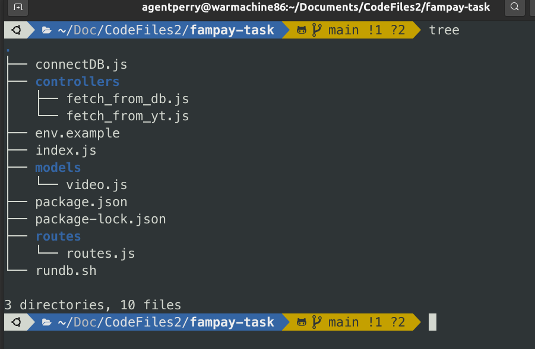

# FP BACKEND TASK

### How to use the application?

1. Clone the repository and install required node package modules

```
https://github.com/surajchoubey/fp-backend-task/
cd fp-backend-task/
npm install
```

2. To run database have MongoDB installed. I have made the set of commands simpler so all you need to do is. (from project root dir)

```
chmod +x ./rundb.sh
./rundb.sh
```

### Storing into Database from Query

For a certain query, 
1. **q** (a query provided by user) 
2. **delay** (default = 10, no of seconds after the server should refetch the data from YT API v3) 

It uses YouTube API v3 to fetch latest videos and store them into the database.
The above operation is executed with the same **query** after a fixed **delay** and it is store in the database.


### Searching from Database while querying

For a certain query, 
1. **q** (a query provided by user)
2. **page** (default = 1, what page of results supposed to fetch from database)
3. **limit** (default = 5, how many results a page should contain) 

It will provide results in reverse chronological order.


### FileSystem



